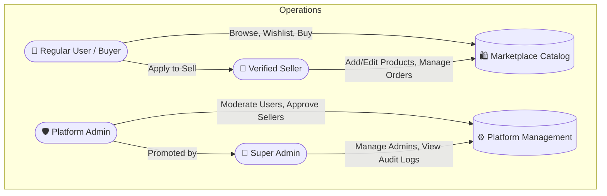

# Anozon E-Commerce Platform

A state-of-the-art, production-ready full-stack e-commerce ecosystem built with a **Python FastAPI & MongoDB** asynchronous backend and a premium **Next.js 15 (App Router)** frontend. Designed with role-based access control (RBAC), multi-portal architectures, dynamic theme switching, and seamless user experiences across buyers, sellers, and administrators.

---

## 🌟 Platform Highlights

- **Multi-Portal Architecture**: Tailored interfaces and routing flows for Buyers (`/`), Sellers (`/seller`), and Admins (`/admin`).
- **Dynamic Theme Engine**: Persistent, seamless Light & Dark modes powered by Tailwind CSS variables and local storage sync across all portals.
- **Robust Security & RBAC**: Advanced JWT authentication with granular permissions for standard users, verified sellers, platform moderators, and super administrators.
- **Email OTP Verification & Redis**: Ephemeral, lightning-fast Redis cache used for secure One-Time Password (OTP) generation and email delivery during user onboarding and password recovery.
- **High-Performance UI**: Built using Next.js 15 Server & Client components, TanStack Query (React Query) for caching, Zustand for global state, and Shadcn UI with Lucide Icons.
- **Asynchronous Backend**: Lightning-fast FastAPI backend utilizing Motor (async PyMongo) for non-blocking MongoDB database transactions and background tasks for automated email dispatch.
- **Comprehensive Checkout**: Flexible ordering with both "Buy Now" (instant single-item checkout) and full Shopping Cart workflows.
- **Order Tracking & Management**: Detailed dynamic order timelines, status-based cancellations, and robust seller fulfillment tools.

---

## 👥 Actor & Role Breakdown

The Anozon platform segregates capabilities across four distinct user tiers, ensuring data privacy, operational security, and tailored workflows.



### 1. 👤 Regular User / Buyer
The primary customer experience focusing on discovery, cart management, and streamlined checkout flows.
- **Discovery & Catalog**: Browse products with advanced real-time server-side filtering (by category, price range, search queries) and pagination.
- **Interactive Product Details**: Immersive product pages featuring high-resolution image galleries, customer reviews, and intelligent "Related Products" dynamic carousels.
- **Cart & Wishlist**: Real-time synced shopping cart with item quantity controls. Persistent personal favorites/wishlist system to track desired items.
- **Order Lifecycle & Checkout**: Multi-step checkout with multiple saved delivery addresses (including default selection). Supports Payment Methods like Cash on Delivery (COD) and placeholders for Razorpay.
- **Order Tracking**: Live timeline tracking for placed orders (Pending -> Confirmed -> Shipped -> Out for Delivery -> Delivered). Includes granular support for cancelling specific items or entire orders (only if not yet shipped).
- **Profile Management**: Maintain multiple addresses, update personal details (Full Name, Mobile), and manage avatar images.
- **Self-Service Onboarding**: Users can apply to become verified sellers directly from their account profile.

### 2. 🏪 Verified Seller
A dedicated commercial command center (`/seller/dashboard`) allowing independent businesses to manage their inventory and sales pipeline.
- **Seller Dashboard**: Visual analytics overview displaying total product counts, active orders, gross sales, and cumulative store ratings.
- **Inventory Management**: Complete CRUD operations for products. Sellers can create new listings with detailed descriptions, inventory quantities, price points, category mappings, and media URLs.
- **Fulfillment & Orders**: Track customer orders containing their products and update fulfillment statuses (mark as Shipped, Delivered, etc.).
- **Customer Interaction**: Dedicated reviews interface with advanced sorting and filtering to monitor buyer sentiment.
- **Business Profile**: Manage commercial identity, including Business Name, Business Type (Individual, Company, Partnership), GSTIN numbers, and official business addresses.

### 3. 🛡️ Platform Administrator
Moderators responsible for maintaining platform integrity, marketplace quality, and user safety (`/admin/dashboard`).
- **Seller Application Moderation**: Review incoming applications from users wishing to sell. Admins can approve legitimate businesses or reject them with specific, actionable feedback.
- **Vendor Compliance**: Suspend or unsuspend existing sellers who violate marketplace terms of service, with mandatory reasoning logs.
- **Marketplace Oversight**: View the global product catalog across all vendors, monitor platform-wide transactions, and review flagged items or suspicious user accounts.
- **User Directory**: Complete visibility into the platform's user base with role filtering capabilities.

### 4. 👑 Super Administrator
The highest level of administrative privilege, overseeing platform governance and administrative accountability.
- **Admin Management**: Exclusive authority to promote standard users to Platform Administrators or revoke administrative rights (`/admin/admins`).
- **Comprehensive Audit Logs**: Complete oversight into sensitive platform mutations (e.g., who approved a seller, who suspended an account, when permissions were modified).

---

## 💻 Technology Stack

### Frontend Architecture (`/frontend`)
- **Framework**: Next.js 15 (React 19) utilizing the modern App Router (`app/`).
- **Styling**: Vanilla CSS tokens & Tailwind CSS for utility-driven responsive design and rich semantic dark-mode aesthetics (using `bg-card`, `border-border`, etc.).
- **State & Caching**: TanStack Query (v5) for server state management and caching; Zustand for lightweight, persistent client state (Auth, Cart, Modals).
- **UI Components**: Custom design system crafted with Shadcn UI primitives (Dropdowns, Dialogs, Avatars, Badges), Framer Motion for micro-animations, and Lucide React icons.
- **Form & Validation**: React Hook Form combined with Zod for rigorous frontend schema validation.
- **Axios Configuration**: Advanced Axios interceptors for automatic JWT refresh token rotation without logging the user out.

### Backend Architecture (`/backend`)
- **Core Framework**: Python 3.11 & FastAPI for high-performance REST APIs.
- **Database Layer**: MongoDB Atlas NoSQL cloud database accessed asynchronously via Motor (`motor_asyncio`).
- **Caching Layer**: Redis cache used for storing short-lived OTP tokens and session parameters.
- **Email Service**: Asynchronous SMTP dispatch (`aiosmtplib` and email templates) for account verification codes, OTPs, and system notifications.
- **Data Validation**: Pydantic v2 for rigorous request/response serialization and OpenAPI schema generation.
- **Authentication**: OAuth2 with JWT (JSON Web Tokens) password bearer flows and secure password hashing using Passlib/Bcrypt.
- **Server**: Uvicorn ASGI server.

---

## 📁 Repository Structure

```text
Anozon-E-commerce/
│
├── backend/                           # Asynchronous FastAPI Service
│   ├── app/
│   │   ├── main.py                    # Application bootstrap & middleware
│   │   ├── core/                      # Config, security, time utils, and logger
│   │   ├── db/                        # MongoDB client & Redis accessors
│   │   ├── models/                    # Pydantic schemas (User, Product, Order, Seller)
│   │   ├── routes/                    # API Endpoints grouped by feature domain
│   │   ├── services/                  # Business logic & repository orchestration
│   │   └── deps/                      # FastAPI dependency providers (Auth, Roles)
│   │
│   ├── seed/                          # Automated data seeding & emergency restoration
│   ├── server.py                      # Uvicorn execution entrypoint
│   └── requirements.txt               # Backend Python dependencies
│
└── frontend/                          # Next.js 15 Client & Server App
    ├── app/
    │   ├── (user)/                    # Main Storefront & Buyer Routes
    │   ├── (seller)/                  # Dedicated Seller Portal Routes
    │   ├── (admin)/                   # Secure Admin & Super Admin Routes
    │   ├── auth/                      # Authentication (Login, Register, OTP)
    │   ├── layout.tsx                 # Root layout & Theme providers
    │   └── globals.css                # Global styles & Tailwind layers
    │
    ├── components/
    │   ├── admin/                     # Admin dashboard UI components
    │   ├── orders/                    # Order timeline & detail components
    │   ├── products/                  # Product carousels, lists, and detail cards
    │   ├── seller/                    # Seller sidebar, forms & analytics
    │   ├── shared/                    # Navbars, modals, theme toggles & wrappers
    │   └── ui/                        # Reusable Shadcn UI building blocks
    │
    ├── hooks/                         # TanStack Query custom data hooks (useCart, useAuthHook)
    ├── lib/                           # Utility functions, Axios interceptors, formatters
    ├── store/                         # Zustand global stores (useAuthStore)
    └── types/                         # TypeScript interfaces & domain models
```

---

## 🚀 Running the Project Locally

### Prerequisites
- Node.js 18.18+ (Node 20+ recommended)
- Python 3.11+
- MongoDB instance (Local or Atlas Cloud)
- Redis instance (Local or Upstash Cloud for OTP caching)

### 1. Starting the Backend
Navigate to the backend directory, install dependencies, and launch the API server:
```bash
cd backend
python -m venv venv
source venv/bin/activate  # On Windows use: venv\Scripts\activate
pip install -r requirements.txt
python server.py
```
*The API will run on `http://localhost:8000` with documentation available at `http://localhost:8000/docs`.*

### 2. Starting the Frontend
Navigate to the frontend directory, install Node packages, and start the development server:
```bash
cd frontend
npm install
npm run dev
```
*The web portal will be accessible at `http://localhost:3001` (or your configured port).*

---
