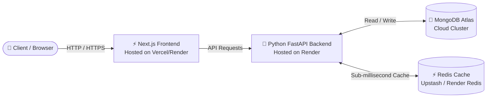

# 🚀 Anozon E-Commerce: Full Production Deployment Plan

This document provides a comprehensive analysis and step-by-step implementation guide for deploying the **Anozon E-Commerce platform** to a production environment using your chosen stack: **Next.js (Frontend)**, **Python FastAPI (Backend on Render)**, **MongoDB Atlas (Database)**, and **Redis (Cache)**.

---

## 🏗️ 1. Architecture & Stack Overview



### Component Breakdown
*   **Frontend (`/frontend`)**: Built with **Next.js 15 (React 19)**, Tailwind CSS, Zustand, TanStack Query.
*   **Backend (`/Backend`)**: Built with **Python 3.11 & FastAPI**, Uvicorn server, Pydantic settings.
*   **Database**: **MongoDB Atlas** (Managed Cloud NoSQL Database).
*   **Cache**: **Redis** (Currently local Docker; migrating to managed cloud Redis for production).

---

## ⚖️ 2. Containerized vs. Git-Based (PaaS) Deployment: The Core Difference

You asked: *"Whether we need to make this entire containerized and deploy or push to GitHub and deploy, what is the difference?"*

Here is a detailed architectural comparison between the two approaches:

| Feature / Metric | 🐳 Full Containerized (Docker on VPS/VM) | 🐙 Git-Based PaaS (Push to GitHub & Deploy) |
| :--- | :--- | :--- |
| **How It Works** | You bundle Frontend, Backend, and Redis into Docker containers and run them on a virtual server (e.g., AWS EC2, DigitalOcean Droplet) using `docker-compose`. | You push code to GitHub. Cloud platforms (Vercel, Render) hook into your repo, automatically detect your framework, build, and host the app. |
| **Setup & Complexity** | **High**: You must manage Linux server OS, firewall rules, Nginx reverse proxy, SSL certificates (Certbot), and Docker networking manually. | **Low / Zero-Config**: Platforms handle SSL, domain routing, reverse proxying, and container runtimes completely under the hood. |
| **CI / CD Pipeline** | **Manual / Custom**: You must write GitHub Actions workflows or SSH into the server to `git pull` and `docker-compose up --build` on every update. | **Instant & Automated**: Every `git push` to the `main` branch instantly triggers a zero-downtime automated build and deployment. |
| **Frontend CDN & Edge** | **None**: The Next.js app is served from a single server location unless you manually configure Cloudflare/CDN in front of it. | **Global Edge Network**: Vercel/Render distributes static assets globally across Edge networks for blazingly fast load times. |
| **Maintenance & Scaling** | You are responsible for OS security patches, disk space management, and manual scaling if traffic spikes. | Fully managed infrastructure. Auto-scales effortlessly based on incoming traffic demands. |
| **Cost Structure** | Predictable flat monthly fee (e.g., $10 - $20/month for a VPS). | Generous Free/Starter tiers, scaling dynamically based on bandwidth and build minutes. |

### 🏆 Clear Recommendation for Anozon
**Use the Git-Based (PaaS) Workflow (Push to GitHub & Deploy).**

Given your specific stack (**Next.js**, **Render**, **Atlas**), trying to manually containerize and host everything on a single VPS defeats the massive advantages of these cloud platforms. 
*   **MongoDB Atlas** is already a fully managed cloud database.
*   **Vercel / Render** provide state-of-the-art Next.js hosting with instant CI/CD.
*   **Render** natively supports Python web services via Git hooks.

By connecting your GitHub repository directly to Vercel/Render, you achieve **enterprise-grade reliability with zero DevOps overhead**.

---

## 🗺️ 3. Recommended Production Deployment Plan (Step-by-Step)

### Phase 1: Database & Cache Preparation

#### 1. MongoDB Atlas Configuration
1.  Log in to [MongoDB Atlas](https://www.mongodb.com/cloud/atlas).
2.  Navigate to **Network Access** under Security.
3.  Click **Add IP Address** -> Select **Allow Access From Anywhere** (`0.0.0.0/0`). *(Required because cloud services like Render dynamically assign IP addresses).*
4.  Navigate to **Database** -> Click **Connect** -> Choose **Drivers** (Python).
5.  Copy your exact connection string:
    ```
    mongodb+srv://<username>:<password>@cluster01.ikno41i.mongodb.net/?retryWrites=true&w=majority&appName=Cluster01
    ```

#### 2. Production Redis Cache (Upstash or Render Redis)
Since your local Docker Redis cannot be accessed over the internet by Render, you need a cloud Redis instance:
*   **Option A (Render Redis)**: In your Render dashboard, click **New +** -> **Redis**. (Instant internal connection to your Render backend).
*   **Option B (Upstash Redis)**: Go to [Upstash](https://upstash.com/), create a free Serverless Redis database, and copy the `REDIS_URL` (starts with `rediss://`).

---

### Phase 2: Backend Deployment on Render

Render will host your FastAPI Python backend directly from your GitHub repository.

#### 1. Prepare Backend Repository Structure
Ensure your `Backend/requirements.txt` is up to date and your root repository is pushed to GitHub.

#### 2. Create Render Web Service
1.  Log in to [Render](https://render.com/) and click **New +** -> **Web Service**.
2.  Connect your GitHub repository (`Anozon-E-commerce`).
3.  Configure the service settings:
    *   **Name**: `anozon-backend`
    *   **Root Directory**: `Backend` (Crucial: Tells Render where the backend code lives).
    *   **Environment**: `Python 3`
    *   **Build Command**: `pip install --upgrade pip && pip install -r requirements.txt`
    *   **Start Command**: `uvicorn app.main:app --host 0.0.0.0 --port 10000` *(Or `python server.py`)*

#### 3. Configure Backend Environment Variables on Render
Under the **Environment Variables** tab in Render, add the following production values:

```ini
ENVIRONMENT=production
MONGO_URL=mongodb+srv://<username>:<password>@cluster01.ikno41i.mongodb.net/?retryWrites=true&w=majority
DB_NAME=Anozon_E-Commernce_db
REDIS_URL=rediss://default:<your-redis-password>@<your-cloud-redis-endpoint>
JWT_SECRET=your_super_secure_production_random_secret_32_chars
JWT_ALGORITHM=HS256
ACCESS_TOKEN_EXPIRE_MINUTES=15
REFRESH_TOKEN_EXPIRE_DAYS=7

# Email & Third-Party APIs
EMAIL_SERVER=smtp.gmail.com
EMAIL_PORT=587
EMAIL_USER=harish13032003@gmail.com
EMAIL_PASS=<your_gmail_app_password>
MAIL_FROM=harish13032003@gmail.com
MAIL_FROM_APP=Anozon
```

4.  Click **Deploy Web Service**. Render will automatically provision the server, install dependencies, and give you a secure live URL (e.g., `https://anozon-backend.onrender.com`).

---

### Phase 3: Frontend Deployment (Vercel or Render)

For Next.js, **Vercel** is the gold standard for performance and zero-config deployment. (Alternatively, you can host it as a Static Web Service or Node service on Render).

#### 1. Deploying on Vercel (Recommended)
1.  Log in to [Vercel](https://vercel.com/) and click **Add New** -> **Project**.
2.  Import your `Anozon-E-commerce` GitHub repository.
3.  In the configuration dialog:
    *   **Root Directory**: Click **Edit** -> Select `frontend`.
    *   **Framework Preset**: Vercel will automatically detect **Next.js**.
    *   **Build Command**: `npm run build` (or `next build`).
    *   **Install Command**: `npm install`.

#### 2. Configure Frontend Environment Variables
In the Vercel deployment settings under **Environment Variables**, add:

```ini
NEXT_PUBLIC_API_URL=https://anozon-backend.onrender.com
```
*(Replace with your exact live Render backend URL).*

4.  Click **Deploy**. Vercel will build your Next.js application and deploy it to a global edge network.

---

## 🔒 4. Crucial Production Configurations & Checklists

### 1. Update Backend CORS for Production
In your backend codebase (`Backend/app/main.py`), verify that your CORS middleware allows requests from your new Vercel production domain.

```python
from fastapi.middleware.cors import CORSMiddleware

app.add_middleware(
    CORSMiddleware,
    allow_origins=[
        "http://localhost:3000",
        "https://anozon-frontend.vercel.app",  # Add your live Vercel domain!
        "https://yourcustomdomain.com"
    ],
    allow_credentials=True,
    allow_methods=["*"],
    allow_headers=["*"],
)
```

### 2. Full Verification Checklist
*   [ ] **Database Connection**: MongoDB Atlas network access allows Render IP range (`0.0.0.0/0`).
*   [ ] **Cloud Redis**: Redis connection configured via secure `rediss://` protocol.
*   [ ] **API Routing**: Frontend environment variable `NEXT_PUBLIC_API_URL` correctly points to Render backend HTTPS URL.
*   [ ] **Authentication**: Secure 32+ character `JWT_SECRET` generated for production.
*   [ ] **SSL & HTTPS**: Both Vercel and Render automatically enforce HTTPS connections.

---

## 🔄 5. Future CI/CD Workflow

Once this initial setup is complete, your development and deployment workflow becomes completely effortless:

1.  **Develop Locally**: Run your local Docker compose (`docker-compose up -d`) to test changes.
2.  **Commit & Push**: Commit your changes and push to GitHub:
    ```bash
    git add .
    git commit -m "feat: added new wishlist features"
    git push origin main
    ```
3.  **Automatic Deploy**: 
    *   Vercel detects changes in `/frontend` and deploys the UI.
    *   Render detects changes in `/Backend` and restarts your FastAPI server with zero downtime.
